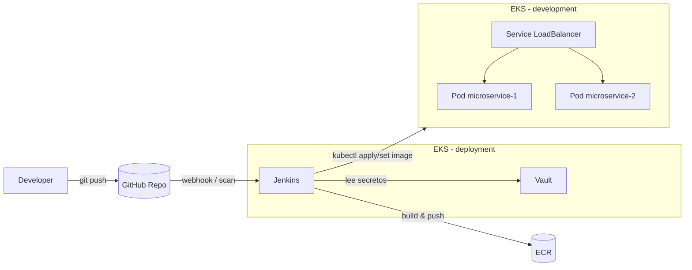

---

## 6. Documentación técnica

### 6.1 Instrucciones para levantar los clústeres

#### 6.1.1 Prerrequisitos

* Cuenta de AWS con permisos para crear EKS, VPC, ECR y recursos asociados.
* Herramientas instaladas en la máquina de trabajo:

  * `awscli` configurado (`aws configure`) con el perfil que se usará.
  * `kubectl` compatible con la versión de EKS.
  * `terraform` (versión >= 1.5).
  * `helm` (para desplegar Vault).
  * `git` y `docker`.
* Región usada: `eu-west-1` (puede modificarse en `terraform.tfvars`).

#### 6.1.2 Despliegue del clúster de deployment (Jenkins + Vault)

1. **Clonar el repositorio**

   ```bash
   git clone https://github.com/<organizacion>/<repo>.git
   cd <repo>
   ```

2. **Crear la infraestructura del clúster de deployment**

   ```bash
   cd terraform/deployment
   terraform init
   terraform apply -auto-approve
   ```

   Esto crea:

   * VPC, subnets públicas, security groups.
   * Cluster EKS `eks-deployment`.
   * Node group administrado para correr Jenkins y Vault.
   * ECR repo para la imagen del microservicio.

3. **Configurar `kubeconfig` del clúster de deployment**

   ```bash
   aws eks --region eu-west-1 \
     update-kubeconfig --name eks-deployment
   ```

4. **Crear namespace y recursos de Jenkins**

   ```bash
   kubectl create namespace jenkins

   # ServiceAccount + RBAC
   kubectl apply -f k8s/jenkins/jenkins-rbac.yaml

   # Volumen para /var/jenkins_home
   kubectl apply -f k8s/jenkins/jenkins-pvc.yaml

   # Deployment + Service tipo LoadBalancer
   kubectl apply -f k8s/jenkins/jenkins-deployment.yaml
   kubectl apply -f k8s/jenkins/jenkins-service.yaml
   ```

   Una vez que el LoadBalancer esté disponible, se obtiene la URL de Jenkins con:

   ```bash
   kubectl -n jenkins get svc jenkins
   ```

5. **Desplegar Vault en el namespace `vault`**

   ```bash
   kubectl create namespace vault

   helm repo add hashicorp https://helm.releases.hashicorp.com
   helm repo update

   helm install vault hashicorp/vault \
     --namespace vault \
     --set "server.dev.enabled=true"
   ```

   Esto crea:

   * Pod `vault-0` con Vault en modo dev.
   * Servicio `vault` (ClusterIP).
   * Pod `vault-agent-injector` para inyección de secretos en pods, si se desea.

6. **Crear el secreto en Vault**

   Se puede acceder vía port-forward:

   ```bash
   kubectl -n vault port-forward svc/vault 8200:8200
   ```

   * Abrir `http://127.0.0.1:8200`.
   * Login con el token de root (entregado por el pod en logs o configurado en Helm).
   * Habilitar el secrets engine KV v2 (por defecto `secret/`).
   * Crear el secreto:

     * Path: `secret/microservice`
     * Datos, por ejemplo:

       * `APP_SECRET = super-secret-from-vault`

#### 6.1.3 Despliegue del clúster de development (microservicio)

1. **Crear infraestructura del clúster de development**

   ```bash
   cd terraform/development
   terraform init
   terraform apply -auto-approve
   ```

   Esto crea el cluster `eks-development` en la misma VPC (o VPC separada, según el código IaC).

2. **Configurar `kubeconfig` del clúster de development**

   ```bash
   aws eks --region eu-west-1 \
     update-kubeconfig --name eks-development
   ```

3. **Desplegar el microservicio**

   Los manifiestos asumen:

   * Namespace: `microservice`
   * 2 réplicas detrás de un Service tipo LoadBalancer.

   ```bash
   kubectl create namespace microservice
   kubectl apply -f k8s/development/deployment.yaml
   ```

   Verificación:

   ```bash
   kubectl -n microservice get pods
   kubectl -n microservice get svc
   ```

   El `EXTERNAL-IP` expone el microservicio hacia internet.

---

### 6.2 Explicación del pipeline CI/CD y uso de Vault

El pipeline está definido en un `Jenkinsfile` ubicado en `app/microservice/Jenkinsfile` y es ejecutado por un **multibranch pipeline** conectado a GitHub.

#### 6.2.1 Flujo general

1. **Checkout**
   Jenkins clona el repositorio de GitHub, ubicando el código en `${WORKSPACE}`.

2. **Lectura de secretos desde Vault**
   Se usa el plugin **HashiCorp Vault Plugin** en Jenkins.

   * Configuración global:

     * *Vault URL*: `http://vault.vault.svc.cluster.local:8200`
       (hostname del servicio `vault` en el namespace `vault`).
     * *Credentials*: token almacenado en un `Secret text` con id `vault-token`.
   * El pipeline usa `wrap([$class: 'VaultBuildWrapper', ...])` para exponer el secreto como variable de entorno antes del build.

   Ejemplo de bloque en el `Jenkinsfile`:

   ```groovy
   podTemplate(
       cloud: 'kubernetes',
       namespace: 'jenkins',
       serviceAccount: 'jenkins',
       /* containers [...] */
   ) {
     node('ci-agent') {

       def vaultSecret = [
         path: 'secret/microservice',
         secretValues: [[envVar: 'APP_SECRET', vaultKey: 'APP_SECRET']]
       ]

       wrap([$class: 'VaultBuildWrapper', vaultSecrets: [vaultSecret]]) {

         stage('Checkout') {
           checkout scm
         }

         // A partir de aquí APP_SECRET está definido en el entorno
         stage('Build & Test (Maven)') {
           container('maven') {
             dir('prueba_v1c3nt3/app/microservice') {
               sh 'mvn -B clean test'
             }
           }
         }
         ...
       }
     }
   }
   ```

3. **Build y tests (Maven)**
   En el contenedor `maven` se ejecuta:

   ```bash
   mvn -B clean test
   mvn -B package -DskipTests
   ```

4. **Login en ECR (AWS CLI)**
   En el contenedor `aws` se obtiene el password del ECR con `aws ecr get-login-password` y se guarda en un archivo temporal que usa el contenedor `docker`.

5. **Build & Push de la imagen Docker**

   * El contenedor `docker` construye la imagen usando el Dockerfile del microservicio.
   * Se pasa el secreto como `build-arg` para que quede disponible dentro del contenedor:

   ```groovy
   docker build \
     -t ${FULL_IMAGE} \
     --build-arg APP_SECRET=${APP_SECRET} \
     -f ${APP_DIR}/Dockerfile \
     ${APP_DIR}
   docker push ${FULL_IMAGE}
   ```

   En el `Dockerfile` se define, por ejemplo:

   ```dockerfile
   ARG APP_SECRET
   ENV APP_SECRET=${APP_SECRET}
   ```

6. **Deploy a EKS (cluster development)**

   En el contenedor `aws`:

   * Actualiza `kubeconfig` del cluster `eks-development`.
   * Aplica el manifiesto base (namespace, deployment, service).
   * Actualiza la imagen del deployment con la imagen recién generada.
   * Espera al `rollout`.

   Resultado: el cluster de development ejecuta 2 réplicas del microservicio con la imagen nueva.

#### 6.2.2 Endpoints del microservicio

El microservicio Java 17 (por ejemplo, Spring Boot) expone:

* `GET /api/secret`
  Devuelve el valor de `APP_SECRET` inyectado desde Vault, de forma controlada:

  ```json
  { "secret": "super-secret-from-vault" }
  ```

* `GET /api/config`
  Lee una propiedad simulada (p. ej. `app.config.value`) desde un archivo local o variable del sistema:

  ```json
  { "configValue": "valor-config-local" }
  ```

---

### 6.3 Diagrama de arquitectura

Puedes incluir un diagrama hecho en draw.io / Lucidchart, o pegar este diagrama en Mermaid en el README y exportarlo como imagen:

```mermaid
flowchart LR
  Dev[Developer] -->|git push| GitHub[(GitHub Repo)]

  subgraph EKS_deploy [EKS - Cluster deployment]
    JN[Jenkins Deployment\n(namespace jenkins)]
    VT[Vault + Agent Injector\n(namespace vault)]
  end

  subgraph EKS_dev [EKS - Cluster development]
    LB[Service type LoadBalancer]
    MS1[Pod microservice-1]
    MS2[Pod microservice-2]
  end

  GitHub -->|webhook / scan| JN
  JN -->|API HTTP (token vault-token)| VT
  JN -->|build & push| ECR[(Amazon ECR)]
  JN -->|kubectl apply / set image| EKS_dev
  LB --> MS1
  LB --> MS2
```

---

## Entregables

### 1. Contenido del repositorio

Propuesta de estructura de carpetas que puedes documentar:

```text
.
├── app
│   └── microservice
│       ├── src/...
│       ├── pom.xml
│       ├── Dockerfile
│       └── Jenkinsfile
├── terraform
│   ├── deployment
│   │   ├── main.tf
│   │   ├── variables.tf
│   │   └── terraform.tfvars.example
│   └── development
│       ├── main.tf
│       ├── variables.tf
│       └── terraform.tfvars.example
├── k8s
│   ├── jenkins
│   │   ├── jenkins-deployment.yaml
│   │   ├── jenkins-pvc.yaml
│   │   ├── jenkins-rbac.yaml
│   │   └── jenkins-service.yaml
│   └── development
│       └── deployment.yaml    # deployment + service del microservicio
└── README.md
```

Con esto cumples:

* **Código IaC** → directorio `terraform/`.
* **Manifiestos Kubernetes** → directorio `k8s/`.
* **Jenkinsfile y scripts** → `app/microservice/Jenkinsfile` y cualquier script auxiliar (por ejemplo `scripts/create-namespace.sh` si lo usas).

---

### 2. README.md (propuesta de contenido)

Te dejo un README que puedes pegar casi tal cual y adaptar nombres de repo o paths:

````markdown
# Prueba Técnica DevOps – Microservicio Java + EKS + Jenkins + Vault

## 1. Descripción

Esta solución levanta dos clústeres de Kubernetes en AWS EKS mediante Terraform:

- **Cluster de deployment**: aloja Jenkins y Vault. Desde aquí se ejecuta el pipeline CI/CD.
- **Cluster de development**: aloja el microservicio Java 17, expuesto mediante un Load Balancer.

El pipeline de Jenkins se conecta a Vault, lee un secreto y lo inyecta como variable de entorno en la imagen Docker del microservicio antes de construirla y desplegarla.

---

## 2. Prerrequisitos

- Cuenta de AWS y usuario con permisos para EKS/ECR/VPC.
- AWS CLI configurado (`aws configure`).
- Terraform >= 1.5
- kubectl
- Helm
- Docker
- Git

Región usada por defecto: `eu-west-1`.

---

## 3. Cómo levantar los clústeres

### 3.1 Cluster de deployment (Jenkins + Vault)

```bash
git clone https://github.com/<org>/<repo>.git
cd <repo>

cd terraform/deployment
terraform init
terraform apply -auto-approve

aws eks --region eu-west-1 update-kubeconfig --name eks-deployment
````

Desplegar Jenkins:

```bash
kubectl create namespace jenkins
kubectl apply -f k8s/jenkins/jenkins-rbac.yaml
kubectl apply -f k8s/jenkins/jenkins-pvc.yaml
kubectl apply -f k8s/jenkins/jenkins-deployment.yaml
kubectl apply -f k8s/jenkins/jenkins-service.yaml

kubectl -n jenkins get svc jenkins   # obtener la URL del LB
```

Desplegar Vault:

```bash
kubectl create namespace vault
helm repo add hashicorp https://helm.releases.hashicorp.com
helm repo update

helm install vault hashicorp/vault \
  --namespace vault \
  --set "server.dev.enabled=true"
```

Crear el secreto `secret/microservice` con la clave `APP_SECRET`.

### 3.2 Cluster de development (microservicio)

```bash
cd terraform/development
terraform init
terraform apply -auto-approve

aws eks --region eu-west-1 update-kubeconfig --name eks-development

kubectl create namespace microservice
kubectl apply -f k8s/development/deployment.yaml
```

---

## 4. Configuración de Jenkins

1. Acceder a la URL de Jenkins (Service tipo LoadBalancer del namespace `jenkins`).
2. Instalar plugins:

   * **Kubernetes**
   * **HashiCorp Vault**
   * **Pipeline** / **Multibranch Pipeline**
3. Configurar el cloud de Kubernetes:

   * `Kubernetes URL`: vacío (usa in-cluster config).
   * `Kubernetes Namespace`: `jenkins`.
   * Conexión por WebSocket.
4. Crear credenciales:

   * `github-token`: token personal para acceder al repo.
   * `aws-devops`: credencial de tipo AWS para ECR/EKS.
   * `vault-token`: secret text con el token de Vault.
5. Crear un **Multibranch Pipeline** apuntando al repositorio y ruta `app/microservice/Jenkinsfile`.

---

## 5. Pipeline CI/CD

Etapas principales del `Jenkinsfile`:

1. **Checkout** del código desde GitHub.
2. **Lectura de secretos desde Vault** usando el plugin y exponiendo `APP_SECRET` como variable de entorno.
3. **Build & Test (Maven)** del microservicio Java 17.
4. **Packaging del JAR**.
5. **Login en ECR** (AWS CLI) y obtención del password.
6. **Build & Push de la imagen Docker** usando `docker build` y `docker push`.
7. **Deploy a EKS (cluster development)**:

   * `aws eks update-kubeconfig`
   * `kubectl apply -f k8s/development/deployment.yaml`
   * `kubectl set image` para actualizar el deployment con la nueva imagen.
   * `kubectl rollout status` para verificar el despliegue.

---

## 6. Cómo validar que el secreto fue inyectado

1. Obtener la IP pública del LoadBalancer del microservicio:

   ```bash
   kubectl -n microservice get svc
   ```

2. Probar el endpoint que expone el secreto:

   ```bash
   export SERVICE_IP=<EXTERNAL-IP>
   curl http://$SERVICE_IP/api/secret
   ```

   Respuesta esperada:

   ```json
   {
     "secret": "super-secret-from-vault"
   }
   ```

   (El valor real dependerá de lo configurado en Vault).

3. Probar el endpoint de configuración local:

   ```bash
   curl http://$SERVICE_IP/api/config
   ```

   Ejemplo de respuesta:

   ```json
   {
     "configValue": "valor-config-local"
   }
   ```

---

## 7. Capturas y salidas de ejemplo

Se recomienda incluir en la carpeta `docs/`:

* Captura de:

  * Pods de Jenkins y Vault en el cluster de deployment (`kubectl -n jenkins/vault get pods`).
  * Pods y service del microservicio en el cluster de development.
  * Pantalla de Jenkins con un build exitoso del pipeline.
  * Pantalla de Vault mostrando el secreto `secret/microservice`.
* Copias de:

  * Salida de `kubectl -n microservice get pods`.
  * Respuestas de `curl /api/secret` y `curl /api/config`.

---

## 8. Diagrama de arquitectura y flujo CI/CD

Ver el archivo `docs/arquitectura-ci-cd.png` generado a partir del siguiente diagrama Mermaid:



---

Con esto cubres exactamente lo que piden en:

* **6. Documentación técnica**
* **Entregables (repo + README.md con instrucciones, validación del secreto, ejemplos y diagrama)** 

Si quieres, en el siguiente mensaje armamos también un pequeño “Informe de resultados” tipo 1–2 páginas donde cuentes qué decisiones técnicas tomaste y qué mejoras harías (eso suele sumar puntos extra).
