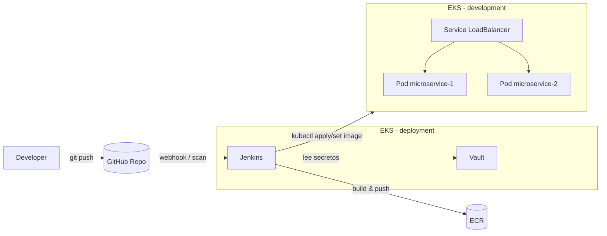

# Prueba Técnica DevOps – Microservicio Java + EKS + Jenkins + Vault

## 1. Descripción

Esta solución levanta dos clústeres de Kubernetes en AWS EKS mediante Terraform:

- **Cluster de deployment**: Jenkins y Vault. Desde aquí se ejecuta el pipeline CI/CD.
- **Cluster de development**: el microservicio Java 17, expuesto mediante un Load Balancer.

El pipeline de Jenkins se conecta a Vault, lee un secreto y lo inyecta como variable de entorno en la imagen Docker del microservicio antes de construirla y desplegarla.

---

## 2. Prerrequisitos

- Cuenta de AWS y usuario con permisos para EKS/ECR/VPC.
- AWS CLI configurado (`aws configure`).
- Terraform >= 1.5
- kubectl
- Helm
- Docker
- Git

Región usada por defecto: `eu-west-1`.

---

## 3. Cómo levantar los clústeres

### 3.1 Cluster de deployment (Jenkins + Vault)

```bash
git clone https://github.com/<org>/<repo>.git
cd <repo>

cd terraform/deployment
terraform init
terraform apply -auto-approve

aws eks --region eu-west-1 update-kubeconfig --name eks-deployment
````

Desplegar Jenkins:

```bash
kubectl create namespace jenkins
kubectl apply -f k8s/jenkins/jenkins-rbac.yaml
kubectl apply -f k8s/jenkins/jenkins-pvc.yaml
kubectl apply -f k8s/jenkins/jenkins-deployment.yaml
kubectl apply -f k8s/jenkins/jenkins-service.yaml

kubectl -n jenkins get svc jenkins   # obtener la URL del LB
```

Desplegar Vault:

```bash
kubectl create namespace vault
helm repo add hashicorp https://helm.releases.hashicorp.com
helm repo update

helm install vault hashicorp/vault \
  --namespace vault \
  --set "server.dev.enabled=true"
```

Crear el secreto `secret/microservice` con la clave `APP_SECRET`.

### 3.2 Cluster de development (microservicio)

```bash
cd terraform/development
terraform init
terraform apply -auto-approve

aws eks --region eu-west-1 update-kubeconfig --name eks-development

kubectl create namespace microservice
kubectl apply -f k8s/development/deployment.yaml
```

---

## 4. Configuración de Jenkins

1. Acceder a la URL de Jenkins (Service tipo LoadBalancer del namespace `jenkins`).
2. Instalar plugins:

   * **Kubernetes**
   * **HashiCorp Vault**
   * **Pipeline** / **Multibranch Pipeline**
3. Configurar el cloud de Kubernetes:

   * `Kubernetes URL`: vacío (usa in-cluster config).
   * `Kubernetes Namespace`: `jenkins`.
   * Conexión por WebSocket.
4. Crear credenciales:

   * `github-token`: token personal para acceder al repo.
   * `aws-devops`: credencial de tipo AWS para ECR/EKS.
   * `vault-token`: secret text con el token de Vault.
5. Crear un **Multibranch Pipeline** apuntando al repositorio y ruta `app/microservice/Jenkinsfile`.

---

## 5. Pipeline CI/CD

Etapas principales del `Jenkinsfile`:

1. **Checkout** del código desde GitHub.
2. **Lectura de secretos desde Vault** usando el plugin y exponiendo `APP_SECRET` como variable de entorno.
3. **Build & Test (Maven)** del microservicio Java 17.
4. **Packaging del JAR**.
5. **Login en ECR** (AWS CLI) y obtención del password.
6. **Build & Push de la imagen Docker** usando `docker build` y `docker push`.
7. **Deploy a EKS (cluster development)**:

   * `aws eks update-kubeconfig`
   * `kubectl apply -f k8s/development/deployment.yaml`
   * `kubectl set image` para actualizar el deployment con la nueva imagen.
   * `kubectl rollout status` para verificar el despliegue.

---

## 6. Cómo validar que el secreto fue inyectado

1. Obtener la IP pública del LoadBalancer del microservicio:

   ```bash
   kubectl -n microservice get svc
   ```

2. Probar el endpoint que expone el secreto:

   ```bash
   export SERVICE_IP=<EXTERNAL-IP>
   curl http://$SERVICE_IP/api/secret
   ```

   Respuesta esperada:

   ```json
   {
     "secret": "super-secret-from-vault"
   }
   ```

   (El valor real dependerá de lo configurado en Vault).

3. Probar el endpoint de configuración local:

   ```bash
   curl http://$SERVICE_IP/api/config
   ```

   Ejemplo de respuesta:

   ```json
   {
     "configValue": "valor-config-local"
   }
   ```

---

## 7. Capturas y salidas de ejemplo

Se recomienda incluir en la carpeta `docs/`:

* Captura de:

  * Pods de Jenkins y Vault en el cluster de deployment (`kubectl -n jenkins/vault get pods`).
  * Pods y service del microservicio en el cluster de development.
  * Pantalla de Jenkins con un build exitoso del pipeline.
  * Pantalla de Vault mostrando el secreto `secret/microservice`.
* Copias de:

  * Salida de `kubectl -n microservice get pods`.
  * Respuestas de `curl /api/secret` y `curl /api/config`.

---

## 8. Diagrama de arquitectura y flujo CI/CD

Ver el archivo `docs/arquitectura-ci-cd.png` generado a partir del siguiente diagrama Mermaid:



---

